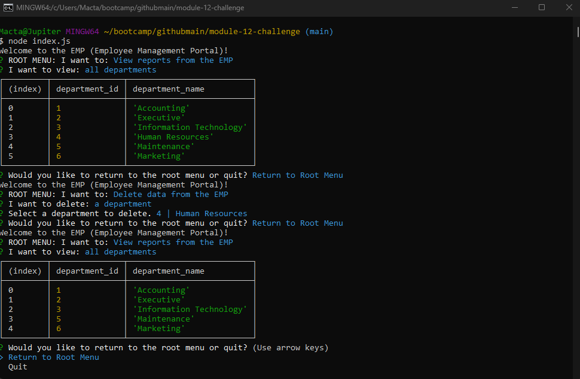

# Employee Management Processor 
GitHub Repo: https://github.com/jheersink8/employee-management-processor

Deployed Site: https://drive.google.com/file/d/13l1FiTamrk5sAVol6SXI48gUcDyi_wWV/view

## Description
This tool is used for users to view employees at their company. They can view predefined queried tables, add data to the database, delete data, and update information. This tool demonstrates a working knowledge of the following tools: 
- PostgreSQL
- The Inquirer NPM
- The Node/PostgreSQL NPM
- Queries for adding, updating, deleting, and viewing 
- Constructor functions
- Node.js

## Installation 
Because this tool is strongly dependent on database queries, it is best to see its functionality with some data. It is highly recommended to run the seed data so that the tool can be populated with data. To seed the database: 

    1. Open a terminal that is running from the same folder as the index.js file
    2. Run the command (with no quotes) "psql -U postgres -f db/schema.sql -f db/seeds.sql"
    3. Enter the password "1234"

Once the database has been seeded, the tool can be invoked by running the following steps: 

    1. Open a terminal that is running from the same folder as the index.js file.
    2. Install the packages by running "npm i"
    3. Invoke the tool by running "node index.js"

## Usage
Once the tool is invoked using the steps above, the user will be presented with inquirer based prompts with questions. The first groups of questions will determine the type of query to run (view, add, update, or delete). In each query question group, the user is presented with several options on queries they can perform (view a table of all managers, delete an employee, update an employee's role, etc.). After they answer the last question, they are given the option to either quit the application or return to the root menu to run another query. 

## Credits
- Scenario presented by Denver University in the Bootcamp course ID DU-VIRT-FSF-PT-12-2023-U-LOLC-MWTH under Module 12 Challenge. All code was generated and submitted by Jordan R. Heersink.
- This tool uses node.js, and PostgreSQL

## License
https://opensource.org/licenses/MIT 

  Copyright (c) {{ 2024 }} {{ Jordan Heersink }}
    Permission is hereby granted, free of charge, to any person obtaining a copy
    of this software and associated documentation files (the "Software"), to deal
    in the Software without restriction, including without limitation the rights
    to use, copy, modify, merge, publish, distribute, sublicense, and/or sell
    copies of the Software, and to permit persons to whom the Software is
    furnished to do so, subject to the following conditions:
    
    The above copyright notice and this permission notice shall be included in all
    copies or substantial portions of the Software.
    
    THE SOFTWARE IS PROVIDED "AS IS", WITHOUT WARRANTY OF ANY KIND,
    EXPRESS OR IMPLIED, INCLUDING BUT NOT LIMITED TO THE WARRANTIES OF
    MERCHANTABILITY, FITNESS FOR A PARTICULAR PURPOSE AND NONINFRINGEMENT.
    IN NO EVENT SHALL THE AUTHORS OR COPYRIGHT HOLDERS BE LIABLE FOR ANY CLAIM,
    DAMAGES OR OTHER LIABILITY, WHETHER IN AN ACTION OF CONTRACT, TORT OR
    OTHERWISE, ARISING FROM, OUT OF OR IN CONNECTION WITH THE SOFTWARE OR THE USE
    OR OTHER DEALINGS IN THE SOFTWARE.